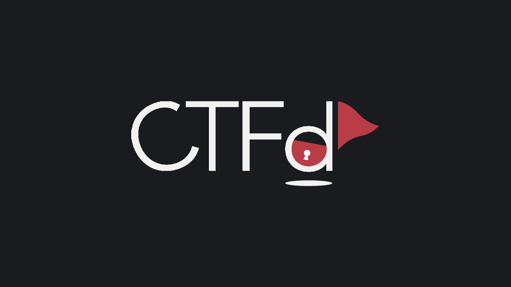

<p align="center">

</p>

<p align="center">
  Be sure to ⭐ this repo so you can keep up to date on any daily progress!
</p>

<p align="center">
<a href="https://github.com/Abhijith14/CTFd" target="_blank">
    
</a>&nbsp;
<a href="https://www.php.net" target="_blank">
    
</a>&nbsp;
<a href="https://github.com/Abhijith14/CTFd" target="_blank">
    
</a>&nbsp;

</p>

<br>

## ⚡️ Quick start

First of all, download and install [XAMPP Control Panel](https://www.apachefriends.org). Copy the repo contents to xampp/htdocs/CTFd and start Apache and MySQL server (refer php + xampp docs).

Now, navigate to:

```bash
localhost/CTFd
```

<br>

## ⭐️ Project assistance

If you want to say **thank you** or/and support active development of `CTFd`:

- Add a [GitHub Star](https://github.com/Abhijith14/CTFd) to the project.
- Write interesting articles about project on [Dev.to](https://dev.to/), [Medium](https://medium.com/) or personal blog.

Together, we can make this project **better** every day! 😘

<br>

### 🛠️ Built With

- [PHP](https://www.php.net) - Backend
- [HTML, CSS & JS]() - Frontend
- [Jquery]()

### ❤️ Authors

- **Abhijith Udayakumar** - *Design & Development* - [Abhijith14](https://github.com/Abhijith14)

<br>
<br>

## 🚨 Forking this repo (please read!)

_**yes, with attribution**_.

I value keeping my work open source, but as you all know, _**plagiarism is bad**_. It's always disheartening whenever I find that someone has copied my work without giving me credit. I spent a non-trivial amount of effort building and designing this project, and I am proud of it! All I ask of you all is to not claim this effort as your own.

### TL;DR

Yes, you can fork this repo. Please give me proper credit by linking back to [Abhijith14/CTFd](https://github.com/Abhijith14/CTFd). Thanks!
